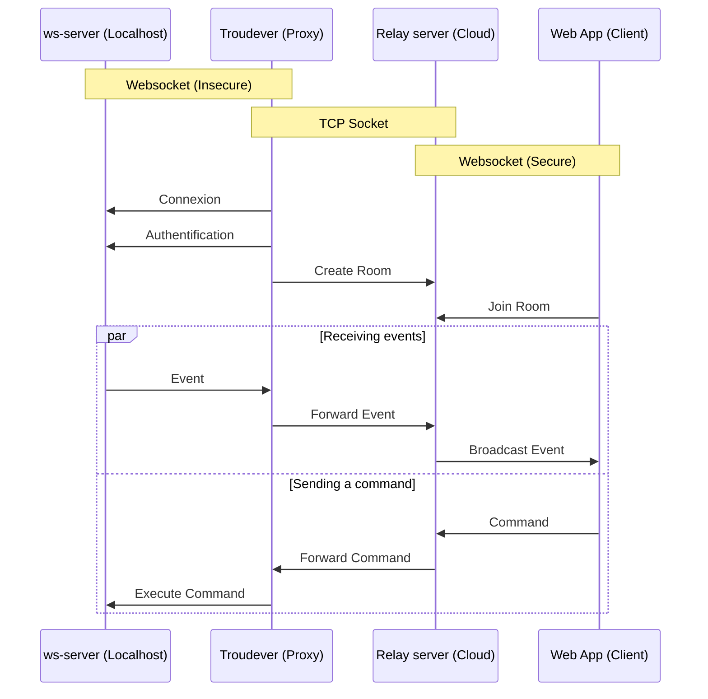

# Troudever

Troudever is a lightweight, high-performance proxy designed to bridge the gap between modern Web Clients and legacy or raw TCP services.

The name implies a "Wormhole" (Trou de ver in French), shortcutting the distance between web protocols and raw sockets. It stands for:

*Tunnel Relay Offering Unrestricted Duplex Exchange Via Encapsulated Routes*

## 🚀 What it does

Browsers speak WebSockets; many backend services speak Raw TCP Sockets. Troudever sits in the middle, handling the handshake and framing so your web apps can talk directly to database ports, game servers, or IoT devices without modifying the backend code.



## ⚡ Key Features
- Protocol Translation: Transparently decapsulates WebSocket frames into raw TCP streams (and vice-versa).
- Full Duplex: True bidirectional communication suitable for real-time applications.
- Zero-Copy Relay: Optimized for low latency and high throughput.
- Agnostic: Works with any TCP target (Redis, SSH, Custom C++ Servers, etc.).

# Quick Start

```Bash
./troudever 
```
